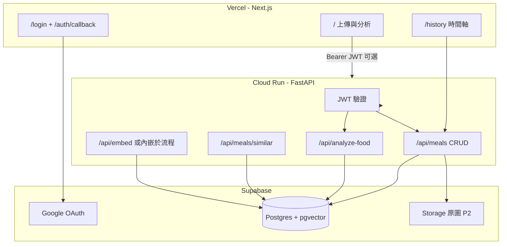
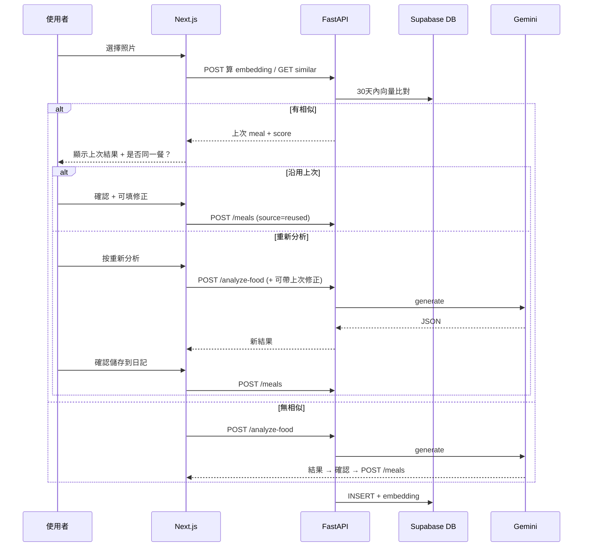

# Project CheekyCat — 產品與技術計劃書 v1.1

> **狀態**：**P1 已驗收**（日記 MVP）；P0 Google OAuth（見 §12、[DEVLOG.md](DEVLOG.md)）  
> **最後更新**：2026-05-26  
> **相關 repo**：前端 `健身App`（Vercel）｜後端 `健身AppBackend`（Cloud Run FastAPI）

---

## 1. 專案願景

| 項目 | 說明 |
|------|------|
| 產品定位 | AI 拍照估算營養的個人健身飲食 Tracker（CheekyCat 人設） |
| 開發初衷 | 預算有限，自建符合個人飲食／健身習慣的 Tracker（見 `README.md`） |
| 現況 | Next.js 上傳照片 → FastAPI `/api/analyze-food` → Gemini Vision |
| 下一階段 | 雲端記憶、多裝置、使用者隔離、相似圖輔助與可選省費 |
| 目標週期 | 約 **2 週**，分階段交付 |
| 預算 | 約 **HK$100/月**（約 10 張圖／天） |

---

## 2. 已確認產品決策

### 2.1 使用者與登入（P0）

| # | 決策 |
|---|------|
| 登入方式 | ~~**Email + 密碼**（Supabase Auth）~~ → **Google OAuth**（Supabase Auth）；首次登入即建帳，無 `/signup` |
| 訪客 | **允許試用分析**；**登入後才同步雲端歷史** |
| 訪客資料生命週期 | **關閉分頁即丟棄**（不寫 DB、不依賴長期 localStorage） |
| 託管方案 | **Supabase**（Auth + Postgres + Storage + pgvector）— 省事、主流、利於作品集 |
| 使用者規模 | 現階段 **家人朋友**；架構預留 **未來陌生人**（RLS + 日後註冊開關） |

**變更說明（v1.1）**：家人自用改為僅 Google 登入，免記密碼與確認信；JWT／FastAPI 驗證流程不變。原因與 Step 0 設定見 [DEVLOG.md](DEVLOG.md) §2026-05-26。

### 2.2 資料與隱私

| # | 決策 |
|---|------|
| 儲存內容 | **原圖** + **營養 JSON** + **時間**（原圖雲端存檔在 **P2**） |
| 保留 | **永久**，支援 **手動刪除單筆** |
| 合規 | 家人自用階段不深入 GDPR；具備刪除權即可；完整匯出留 **P4** |
| 翻看 UI | **時間軸列表**（依 `created_at` 倒序） |

### 2.3 分析與存檔流程（P1 核心）

| # | 決策 |
|---|------|
| 存檔時機 | **非上傳即存** → 先顯示 AI 結果 → 使用者 **確認後** 才「儲存到日記」 |
| AI 猜錯 | 允許使用者填寫 **修正提示詞**（`user_correction_note`）；相似圖時可 **帶入上次修正** 作為 Gemini prompt 上下文 |
| 語言 | **僅繁體中文**（暫不做英文） |

### 2.4 相似圖 / Embedding（P3）

| # | 決策 |
|---|------|
| 比對範圍 | 僅 **最近 30 天**、僅 **同一 `user_id`** |
| 流程順序 | **先算 embedding 比對** → 若相似則 **先顯示上次結果並詢問** → 使用者按 **「重新用 AI 分析」** 才呼叫 Gemini |
| 預設傾向 | 傾向 **重新分析**；「沿用上次」為 **次要按鈕**（省 Gemini 費用） |
| 輔助 AI | 相似且歷史有使用者修正時，重算時將修正 **注入 prompt**（仍以上傳照片為準） |
| 典型場景 | 家常菜、連鎖店（如譚仔／三哥）等 **重複外觀** 的餐點 |
| 向量寫入時機 | 僅在使用者 **確認存檔** 後寫入 `meals` + `embedding`（避免垃圾向量） |

### 2.5 技術分工

| 層級 | 職責 |
|------|------|
| **Vercel / Next.js** | UI、Supabase 登入 session、帶 Bearer token 呼叫 FastAPI |
| **Cloud Run / FastAPI** | JWT 驗證、Gemini、embedding、meals CRUD、相似度查詢、組 prompt |
| **Supabase** | Auth、Postgres（含 pgvector）、Storage（P2 原圖）、RLS |

**為何保留 FastAPI**：Gemini API key、大檔、embedding、業務邏輯不暴露前端；與既有 `健身AppBackend/main.py` 部署一致。

### 2.6 階段優先級（2 週）

| 階段 | 內容 | 時程 |
|------|------|------|
| **P0** | Supabase Auth、JWT、FastAPI 驗證、訪客仍可 analyze | 第 1 週初 |
| **P1** | 確認後存檔、時間軸、修正提示詞、刪除；訪客不寫庫 | 第 1 週 |
| **P2** | Storage 原圖、列表縮圖、刪除連動 | 第 2 週初 |
| **P3** | embedding、30 天相似、詢問 UI、沿用／重算、prompt 輔助 | 第 2 週中 |
| **P4**（可選） | 每日熱量加總、匯出、註冊開關（公開前） | 2 週後 |

**MVP 定義（第 1 週末）**：P0 + P1（可不含 P2 原圖，列表先顯示文字營養資料）。

---

## 3. 系統架構



### 3.1 核心使用者流程（已登入）



### 3.2 訪客流程

- 可呼叫 `POST /api/analyze-food`（**無 JWT** 或 optional auth）。
- 結果僅存在 **React state / memory**；**關閉分頁即丟棄**。
- UI 提示：「登入以將餐點存入日記並在多裝置同步」。
- **不提供**「關閉後還原上一筆」或登入後自動匯入訪客分析（避免複雜度）。

---

## 4. 資料模型（Supabase Postgres）

### 4.1 表：`meals`

| 欄位 | 型別 | 說明 |
|------|------|------|
| `id` | `uuid` PK | `gen_random_uuid()` |
| `user_id` | `uuid` NOT NULL | `auth.users.id`，RLS 隔離 |
| `created_at` | `timestamptz` | 使用者按下「儲存到日記」時間 |
| `dish_name` | `text` | |
| `calories_kcal` | `int` | |
| `protein_g` | `float` | |
| `carbs_g` | `float` | |
| `fat_g` | `float` | |
| `visual_clues` | `jsonb` | 字串陣列 |
| `assumption_and_blindspots` | `text` | |
| `confidence_score` | `float` | 0–1 |
| `cheeky_cat_comment` | `text` | |
| `user_correction_note` | `text` nullable | 使用者修正提示詞 |
| `analysis_source` | `text` | `gemini_fresh` \| `reused_previous` |
| `reused_from_meal_id` | `uuid` nullable | 沿用上次時指向來源 |
| `image_path` | `text` nullable | P2：`{user_id}/{meal_id}.jpg` |
| `embedding` | `vector(n)` nullable | P3；維度依 embedding 模型（實作時定，如 768） |

**索引建議**：

- `(user_id, created_at DESC)`
- pgvector：`embedding` + `user_id` 過濾（30 天在查詢用 `created_at >= now() - interval '30 days'`）

### 4.2 RLS 政策（最小集）

```sql
-- 僅能 CRUD 自己的 meals
CREATE POLICY "meals_select_own" ON meals FOR SELECT USING (auth.uid() = user_id);
CREATE POLICY "meals_insert_own" ON meals FOR INSERT WITH CHECK (auth.uid() = user_id);
CREATE POLICY "meals_update_own" ON meals FOR UPDATE USING (auth.uid() = user_id);
CREATE POLICY "meals_delete_own" ON meals FOR DELETE USING (auth.uid() = user_id);
```

> FastAPI 使用 **service role** 或 **驗證使用者 JWT 後以 user_id 過濾** 二選一；建議 FastAPI 驗 JWT 後用 **user JWT + Supabase client**，或 service role + **強制 WHERE user_id = sub**（不可信任 client 傳入的 user_id）。

### 4.3 Storage（P2）

- Bucket：**private**
- 路徑：`{user_id}/{meal_id}.{ext}`
- 讀取：signed URL（短期）或經 FastAPI 代理

---

## 5. API 規格（FastAPI 擴充）

後端現有：`POST /api/analyze-food`（`健身AppBackend/main.py`）。

### 5.1 端點一覽

| 方法 | 路徑 | Auth | 說明 |
|------|------|------|------|
| `POST` | `/api/analyze-food` | 可選 | Gemini 分析；body 可含 `prior_correction`、`prior_meal_id` 增強 prompt |
| `POST` | `/api/meals/check-similar` | **必填** | 上傳圖片 → 算 embedding → 30 天內比對 → 回 `{ similar, meal?, score? }` |
| `POST` | `/api/meals` | **必填** | 確認存檔；寫入營養 JSON + 時間 + 可選修正；P2 multipart 含原圖 |
| `GET` | `/api/meals` | **必填** | 時間軸 `?limit=&offset=` |
| `GET` | `/api/meals/{id}` | **必填** | 詳情；非本人 → **404** |
| `DELETE` | `/api/meals/{id}` | **必填** | 刪除列 + P2 刪 Storage 物件 |

### 5.2 Auth Header

```
Authorization: Bearer <supabase_access_token>
```

FastAPI 驗證方式（實作時二選一）：

- `SUPABASE_JWT_SECRET` 本地驗簽；或
- Supabase JWKS URL

`user_id` **只**從 token `sub` 取得，**禁止**信任 request body 的 `user_id`。

### 5.3 相似度回應（示意）

```json
{
  "similar": true,
  "score": 0.91,
  "meal": {
    "id": "...",
    "created_at": "...",
    "dish_name": "...",
    "calories_kcal": 650,
    "user_correction_note": "這是譚仔酸辣過橋，醬料偏油"
  }
}
```

門檻 `SIMILARITY_THRESHOLD`（環境變數，預設待實測，建議起點 **0.88–0.92**）。

### 5.4 CORS

維持並擴充：

- `http://localhost:3000`
- `http://127.0.0.1:3000`
- `https://boompala.vercel.app`（及正式 Vercel 網域）

允許 header：`Authorization`, `Content-Type`。

---

## 6. 前端頁面（Next.js）

| 路由 | 說明 | 階段 |
|------|------|------|
| `/` | 上傳、相似詢問、結果、修正輸入、「儲存到日記」 | P0–P3 |
| `/login` | 「用 Google 登入」→ OAuth | P0 |
| `/auth/callback` | OAuth 導回、建立 session | P0 |
| `/history` | 時間軸列表 | P1 |
| `/history/[id]` | 詳情、修正備註、刪除 | P1；P2 顯示原圖 |

### 6.1 首頁 UI 狀態機（登入使用者）

1. 選圖  
2. **check-similar**（loading）  
3a. 相似 → 顯示上次卡片 + 「是同一餐（沿用）」／「重新分析」  
3b. 不相似 → **analyze-food**  
4. 顯示結果 + 可編輯 `user_correction_note`  
5. 「儲存到日記」→ `POST /meals` → 成功提示 → 可連到 `/history`  

### 6.2 訪客 UI

- 跳過 check-similar（或僅 analyze，**不做雲端相似查詢**）— 實作時可簡化為訪客直接 analyze。  
- 無「儲存到日記」或按鈕導向登入。  
- 關閉分頁不提示恢復。

---

## 7. 分階段任務與驗收

### P0 — 身分與安全基線（約 2 天）

**任務**

- [ ] 建立 Supabase 專案、Google provider（建議關閉 Email provider）
- [ ] Next：`@supabase/ssr`、`signInWithOAuth`、callback、登出
- [ ] FastAPI：JWT dependency、`current_user_id`
- [ ] Stub：`GET /api/meals` 回 401 無 token
- [ ] 訪客仍可 `POST /api/analyze-food`
- [ ] 文件：`.env.example`（前端 + 後端）

**驗收**

- [ ] Google 登入後取得 session，帶 token 打 FastAPI 回 200
- [ ] 無 token 打 `/api/meals` 回 401
- [ ] 訪客 analyze 仍可用

---

### P1 — 日記 MVP（約 3–4 天）✅ 已驗收

**任務**

- [x] migration：`meals` 表 + RLS + `GRANT service_role`
- [x] `POST /api/meals`、`GET` 列表、`GET` 詳情、`DELETE`
- [x] 首頁：analyze → 顯示 → 確認 → 存檔（**不自動存**）
- [x] `user_correction_note` 欄位與表單
- [x] `/history` 時間軸、`/history/[id]` 詳情與刪除
- [x] 訪客：關閉分頁丟棄（僅 in-memory state）

**驗收**

- [x] 手機登入存一筆，電腦登入同一帳號看得到（本機驗收通過）
- [x] 訪客分析不出現在任何人歷史
- [x] 刪除後列表與詳情皆不可見
- [x] 未按「儲存」的不出現在時間軸

---

### P2 — 原圖雲端（約 2 天）

**任務**

- [ ] Storage bucket private
- [ ] `POST /api/meals` 接受圖片並上傳
- [ ] 列表／詳情 signed URL 顯示縮圖
- [ ] `DELETE` 連動刪物件

**驗收**

- [ ] 歷史可看到當初拍的照片
- [ ] 刪除紀錄後 Storage 無殘留（或排程清理）

---

### P3 — 相似圖與省費（約 3 天）

**任務**

- [ ] 選定 embedding 模型（Gemini embedding 或專用視覺模型）
- [ ] `pgvector` extension + 寫入時機（確認存檔後）
- [ ] `POST /api/meals/check-similar`（30 天、同 user）
- [ ] 首頁狀態機：先 similar → 再決定是否 analyze
- [ ] 「沿用上次」不呼叫 Gemini；「重新分析」呼叫並可帶 `user_correction_note`
- [ ] `analysis_source`、`reused_from_meal_id`

**驗收**

- [ ] 同一道菜連拍兩次，第二次先出現上次結果詢問
- [ ] 按重新分析會再打 Gemini
- [ ] 有修正備註時，重算的 prompt 含該備註（log 或測試可驗）

---

### P4 — 未來增強（Out of 2 週）

- 每日熱量加總、月曆
- 資料匯出（GDPR 風格）
- 公開註冊開關、rate limit
- 英文介面

---

## 8. 環境變數清單

### 8.1 前端（Vercel / `.env.local`）

| 變數 | 說明 |
|------|------|
| `NEXT_PUBLIC_API_URL` | FastAPI 基礎 URL（已有） |
| `NEXT_PUBLIC_SUPABASE_URL` | Supabase 專案 URL |
| `NEXT_PUBLIC_SUPABASE_ANON_KEY` | anon key（公開） |

### 8.2 後端（Cloud Run / 本機）

| 變數 | 說明 |
|------|------|
| `GEMINI_API_KEY` | 已有 |
| `GEMINI_MODEL` | 已有 |
| `SUPABASE_URL` | |
| `SUPABASE_SERVICE_ROLE_KEY` 或 `SUPABASE_JWT_SECRET` | 驗證／寫入策略擇一 |
| `SIMILARITY_THRESHOLD` | 預設 0.90（可調） |
| `SIMILARITY_DAYS` | 預設 `30` |
| `CORS_ORIGINS` | 已有，需含 Vercel 網域 |
| `DEBUG` | 已有 |

---

## 9. 預算與風險

| 風險 | 緩解 |
|------|------|
| Gemini 費用超支 | 先 embedding 再決定是否呼叫；沿用上次按鈕明確標示 |
| 相似度誤判 | 門檻可調；UI 永遠提供「重新分析」 |
| 訪客與登入資料不一致 | 訪客不寫庫；關閉分頁即丟棄 |
| 公開後濫用 | P4：註冊開關 + rate limit |
| Cloud Run 冷啟動 | 家人規模可接受；必要時 min instances |

**粗算**：10 張／天 × 30 ≈ 300 次／月；若 30% 沿用上次則 Gemini 呼叫約 210 次，Flash 級通常低於 HK$100（以實際帳單為準）。

---

## 10. 實作工單模板（Agent 用）

每次只開一個 phase，避免一次做滿 2 週範圍。

### P0 工單

```text
依 docs/PLAN-v1.md 實作 P0 only：
- Supabase Google OAuth（不要 Email/密碼表單）
- Next.js /login、/auth/callback、登出與 session
- FastAPI 驗證 Supabase JWT
- 保護 /api/meals 路由（可先 stub）
- 訪客仍可 POST /api/analyze-food
- 更新 .env.example
不要實作 P1 歷史、P2 照片、P3 相似度。
```

### P1 工單

```text
依 docs/PLAN-v1.md 實作 P1 only：
- meals 表 + RLS
- 確認後 POST /api/meals、GET 列表/詳情、DELETE
- /history 時間軸
- 訪客關閉分頁不持久化
不要實作 P2 Storage、P3 embedding。
```

---

## 11. 參考路徑

| 資源 | 路徑 |
|------|------|
| 開發日誌（決策原因） | `docs/DEVLOG.md` |
| 前端首頁 | `app/page.tsx` |
| 後端 API | `C:\Users\user\Desktop\健身AppBackend\main.py` |
| 後端說明 | `Test/AGENTS.md` |
| 正式 API（範例） | `NEXT_PUBLIC_API_URL` → Cloud Run |

---

## 12. 修訂紀錄

| 版本 | 日期 | 說明 |
|------|------|------|
| v1.0 | 2026-05-26 | 定稿：含訪客關閉丟棄、先 embedding 再 Gemini、RLS 預留公開 |
| v1.1 | 2026-05-26 | P0 登入改為僅 **Google OAuth**（原 Email+密碼見 §2.1 刪除線）；詳見 [DEVLOG.md](DEVLOG.md) |
| v1.2 | 2026-05-26 | **P0 已驗收**：Google OAuth、JWKS/ES256 驗簽、`GET /api/meals` 200/401；詳見 [DEVLOG.md](DEVLOG.md) |
| v1.3 | 2026-05-26 | **P1 已驗收**：`meals` 表、確認後存檔、`/history`、service_role 寫庫；詳見 [DEVLOG.md](DEVLOG.md) |
